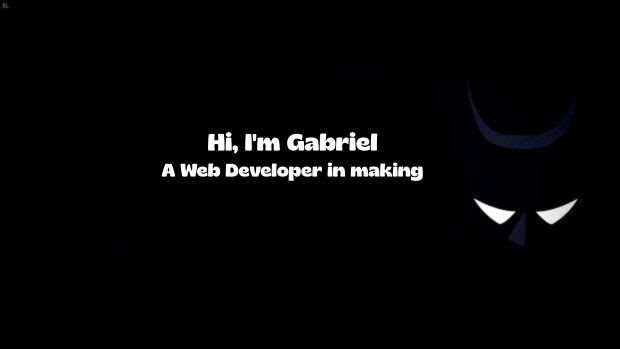

  

Sou estudante do 2º ano de Sistemas Para Internet (TSI) 🎓 no Senac 🏫 . Sou um aprendente apaixonado que está sempre disposto a aprender e trabalhar em diferentes tecnologias e domínios. Adoro explorar novas tecnologias e aproveitá-las para resolver problemas da vida real ✨. Além disso, também adoro guiar e mentorar iniciantes. Atualmente estou focado em Desenvolvimento Web 🌐 e trabalhando nas minhas habilidades de Programacao orientada a objetos🤓

  
 
###  Technology Stack 🛠️

---

 

  
#  My GitHub Stats 📊

### 🌐 Me encontra por aí

---

